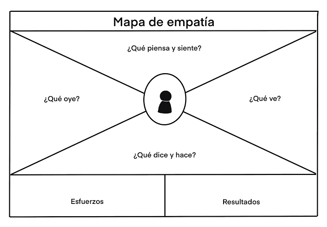

# sesion-02

2026-08-19

hoy día trajimos 3 láminas impresas: journey map, mapa de flujo funcional, mapa de flujo técnico.

darán feedback, y espectadores pueden marcar con un sticker de un punto rojo los hitos que consideren erróneos o que falta profundizar.

## feedback

### user journey map - mapa-1

#### Sergio

no conformarse con no tener mecanismos de retención. Decir que no tiene pq está en contra de ello puede verse como "el camino fácil"

que los dolores sean impedimentos a las acciones q el usuario quiere hacer.

- dolor: en vez de no tengo tiempo para hacer las cosas q me gustan, que sea  la piscina infinita no me deja salir

varias de las categorías se confundes.

podría hacer un mapa de empatía, para separar mejor las categorías

orden: emoción, pensamiento, dolor, oportunidad y finalmente la acción.

tener una carpeta en github donde ponga todo el material servible para la memoria.

#### Simón

ojo con el rigor de la investigación. Es un elemento del que hay que preocuparse.

No pueden estar mis opiniones mezcladas con las del usuario. Debes sistematizar los datos

esto parece más un borrador. ¿como voy a levantar esta información?

DEBES SER MÄS RIGUROSOS CON LA INVESTIGACIÓN.

dejar en claro lo q quieres levantar, y levantarlo. Salgamos de la caja oscura.

#### puntos rojos

- awareness / emoción: mencionaste que no es falta de voluntad del usuario, pero eso no está escrito en ningún lado

- use / dolor: que los dolores sean asociados a impedimentos del usuario para lograr cierta tarea, evitar que los dolores sean fricciones.

## avance

### mapa de empatía

