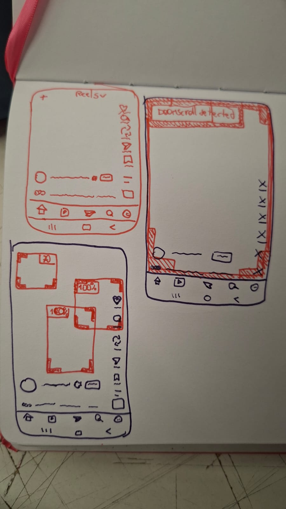
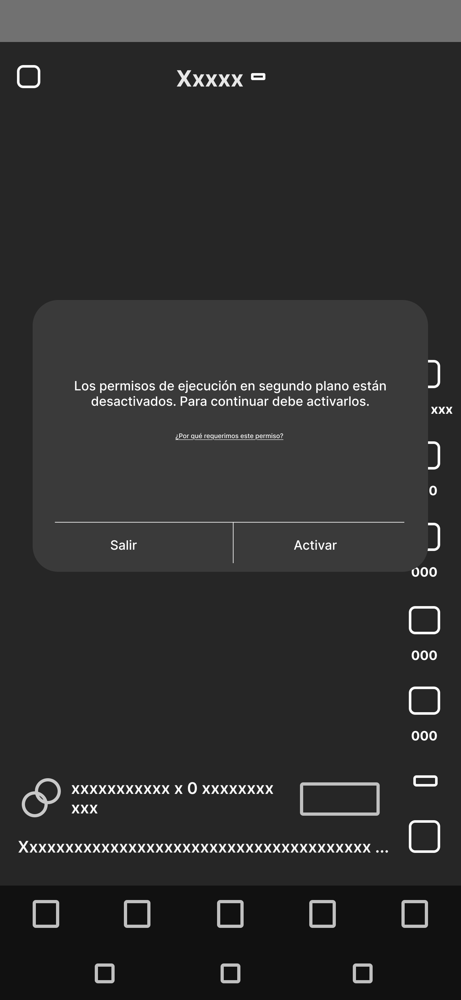
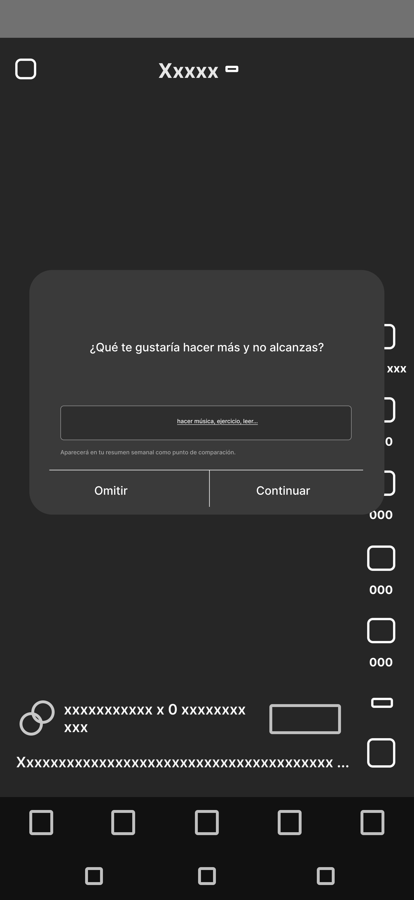
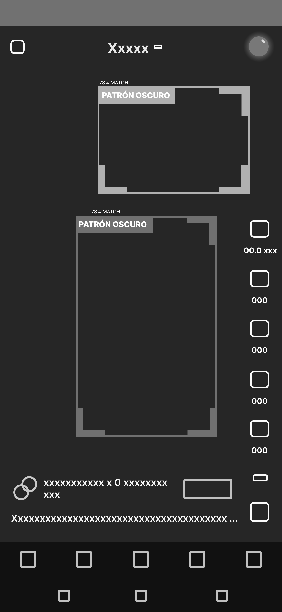
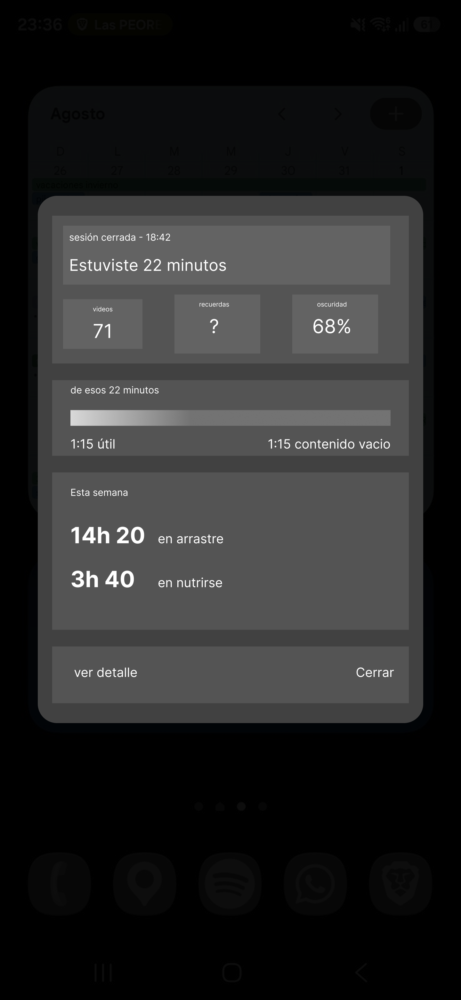

# entrega

[figma wireframes](https://www.figma.com/design/vWfS1EAXfdpQY2XLs1dmyy/wireframes-apk-titulo?node-id=0-1&t=lB9Ulg9SeIE7ZLeL-1)

Resuelve el momento de mayor desconfianza del sistema: pedir acceso a lo que ocurre en pantalla. La justificación del permiso comparte jerarquía con el botón de activación, porque la adopción no depende de aceptar sino de comprender qué se observa y qué no. Es la única pantalla donde la intervención se explica a sí misma, y por eso concentra la carga argumental que el resto del sistema evita.

1. ¿Cuál es el objetivo del usuario aquí?

    activar permisos / entender por qué la app requiere esos permisos.

2. ¿Qué información crítica necesita ver?

    por qué la app necesita acceder a este permiso

3. ¿Qué acción espero que haga?

    que acepte y de permisos sin revisar el por qué

4. ¿En qué orden lo ve? (qué va arriba, qué ocupa más espacio)

    primero ve los botones de cerrar/activar, luego el texto de que necesito permisos. En último lugar el ¿por qué necesito estos permisos?

5. ¿Cómo le hablo si algo no está bien?

    le indico directamente que es algo necesario para usar la app, si no, no puede usar. Le doi claramente la opción de no activar el permiso, pero esto tiene como consecuencia no poder usar la app.

Pide una declaración antes de haber medido nada: qué actividad quisieras sostener y no alcanzas. El dato no describe el uso del teléfono sino algo externo a él, y funcionará como término de comparación en el resumen semanal. La secuencia es deliberada —el sistema solicita acceso y devuelve una pregunta—, de modo que nombrar lo postergado antecede a cualquier cifra sobre el consumo.

1. ¿Cuál es el objetivo del usuario aquí?

    **entregar información** de una actividad a la que le gustaría dedicarle más tiempo

2. ¿Qué información crítica necesita ver?

    para qué utilizará esta información

3. ¿Qué acción espero que haga?

    que entregue información legítima, de una actividad significativa.

4. ¿En qué orden lo ve? (qué va arriba, qué ocupa más espacio)

    primero ve la pregunta, luego la caja de texto con ejemplos. A continuación, en el frame de botones, primero ve el de avanzar y luego el de omitir.

5. ¿Cómo le hablo si algo no está bien?

    le doy a entender claramente que el proceso será menos efectivo si no introduce una respuesta. Y le vuelvo a preguntar. Si vuelve a rechazar responder, se le permite continuar.

El Reel domina la pantalla y el indicador ocupa el margen. No es una concesión: la intervención opera durante el consumo, no antes, porque la conciencia anticipada no suprime el deseo (Berridge y Robinson). El sello señala densidad de patrones engañosos sin bloquear ni calificar el contenido, dejando la conclusión al usuario. Es la única pantalla recurrente del sistema y por eso la de menor peso visual.

1. ¿Cuál es el objetivo del usuario aquí?

    darse cuenta de los patrones engañosos presentes en el contenido que consume.

2. ¿Qué información crítica necesita ver?

    dónde está y cuál es el patrón.

3. ¿Qué acción espero que haga?

    que sea consciente de los contenidos que va destacando la app. Y cuando vea la pantalla con muchos patrones, se fije en el indicador tipo semáforo.

4. ¿En qué orden lo ve? (qué va arriba, qué ocupa más espacio)

primero ve los patrones que se van destacando, y luego se fija en el indicador.

5. ¿Cómo le hablo si algo no está bien?

    - caso sobrecarga de patrones: le proveo la infromación, más no juzgo su consumo

    - caso no se registra información: se asume que la falta de infromación se debe a que el contenido no contiene patrones oscuros

Aparece cuando el usuario abandona la aplicación, no durante el uso. Divide la sesión por origen del contenido —elegido o empujado— y contrasta el acumulado semanal con la actividad declarada en el onboarding. La estructura responde a que el costo del uso no es perceptible por episodio sino por agregado: la desproporción solo aparece cuando alguien la calcula.

1. ¿Cuál es el objetivo del usuario aquí?

    tomar consciencia del tiempo que invierte en Instagram

2. ¿Qué información crítica necesita ver?

    la coparación entre el teimpo que pasa en Instagram y actividades a las que quiere dedicarles más tiempo

3. ¿Qué acción espero que haga?

    que reflexione

4. ¿En qué orden lo ve? (qué va arriba, qué ocupa más espacio)

    primero ve el tiempo semanal acumulado. Luego cuánto duró la sesión, y luego como se distribuye el tiempo de aquella sesión.

5. ¿Cómo le hablo si algo no está bien?

    no se juzga. Se presentan estadísticas. Ejemplo: promedio diario en su rango etario, promedio diario hace 10 años, cuanto tiempo toma aprender una habilidad específica, etc.
